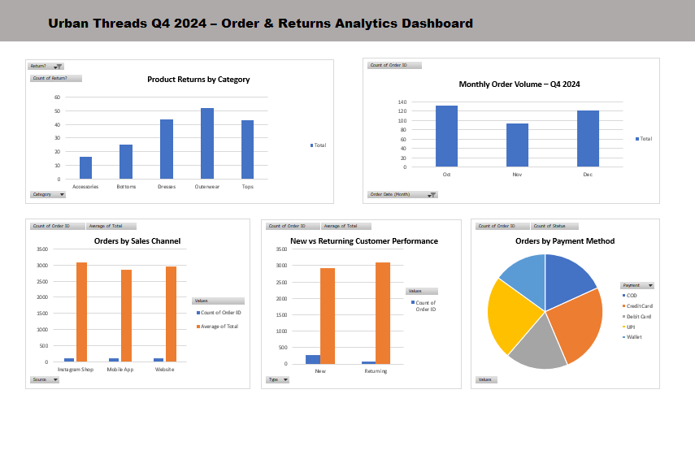

# Urban Threads Q4 2024 Order & Returns Analysis

This project analyzes order and return data for Urban Threads during Q4 2024.

## Objectives
- Identify key drivers of product returns
- Analyze sales performance
- Understand customer behavior

## Tools Used
- Microsoft Excel
- Pivot Tables
- Data Visualization

## Key Insights
- Outerwear and Tops categories have the highest return counts.
- October had the highest sales volume due to seasonal demand.
- Website is the primary sales channel.
- Returning customers show higher average order value.

## Deliverables
- Data cleaning and validation
- KPI calculations
- Pivot table analysis
- Dashboard visualization
- Business recommendations
## Dashboard Preview

